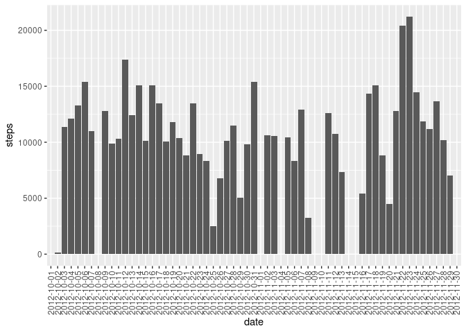
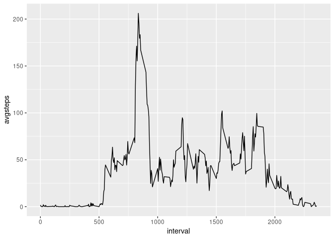
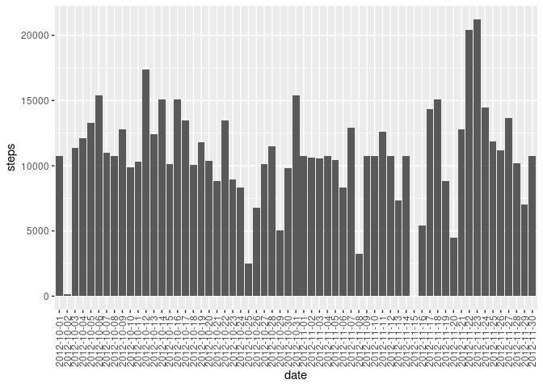

## Introduction

It is now possible to collect a large amount of data about personal
movement using activity monitoring devices such as a
[Fitbit](http://www.fitbit.com), [Nike
Fuelband](http://www.nike.com/us/en_us/c/nikeplus-fuelband), or
[Jawbone Up](https://jawbone.com/up). These type of devices are part of
the "quantified self" movement -- a group of enthusiasts who take
measurements about themselves regularly to improve their health, to
find patterns in their behavior, or because they are tech geeks. But
these data remain under-utilized both because the raw data are hard to
obtain and there is a lack of statistical methods and software for
processing and interpreting the data.

This assignment makes use of data from a personal activity monitoring
device. This device collects data at 5 minute intervals through out the
day. The data consists of two months of data from an anonymous
individual collected during the months of October and November, 2012
and include the number of steps taken in 5 minute intervals each day.

## Loading and preprocessing the data

The data for this assignment can be downloaded from the course web
site:

* Dataset: [Activity monitoring data](https://d396qusza40orc.cloudfront.net/repdata%2Fdata%2Factivity.zip) [52K]

The variables included in this dataset are:

* **steps**: Number of steps taking in a 5-minute interval (missing
    values are coded as `NA`)

* **date**: The date on which the measurement was taken in YYYY-MM-DD
    format

* **interval**: Identifier for the 5-minute interval in which
    measurement was taken

The dataset is stored in a comma-separated-value (CSV) file and there
are a total of 17,568 observations in this
dataset.

### Loading libraries

For this project we need the following libraries: **ggplot2**, **dplyr**, and **timeDate**


```r
library("timeDate")
library("ggplot2")
library("dplyr")
```

```
## 
## Attaching package: 'dplyr'
```

```
## The following objects are masked from 'package:stats':
## 
##     filter, lag
```

```
## The following objects are masked from 'package:base':
## 
##     intersect, setdiff, setequal, union
```

```r
library("formatR")  # For tidy R-Markdown
```

Now, we load the data frame into R and we preprocess it.


```r
## Load data
activitydata <- read.csv("activity.csv")  #Load data

## Add weekday
activitydata$day <- weekdays(as.Date(activitydata$date))

## Add weekday or weekend
isweekday <- isWeekday(activitydata$date, wday = 1:5)
activitydata$wDay <- factor(isweekday, levels = c(FALSE, TRUE), labels = c("weekend", 
    "weekday"))

## Unique days and intervals
days <- unique(activitydata$date)
intervals <- unique(activitydata$interval)
```
## What is mean total number of steps taken per day?

We now create a dataframe with the mean total number steps taken each day


```r
stepsperday <- activitydata %>% group_by(date) %>% summarize(steps = sum(steps, 
    na.rm = T))
```

And then we draw a histogram of this data frame


```r
stepsday <- ggplot(stepsperday, aes(date, steps))
stepsday + geom_col() + theme(axis.text.x = element_text(angle = 90, hjust = 1, 
    vjust = 0.5))
```

<!-- -->

We also calculate the mean and the median total number of steps taken per day. We show the information in a summary


```r
summary(stepsperday$steps)
```

```
##    Min. 1st Qu.  Median    Mean 3rd Qu.    Max. 
##       0    6778   10395    9354   12811   21194
```

## What is the average daily activity pattern?

Now, we make a time series plot of the 5-minute intervals on the x-axis and the average number of steps taken, across all days, on the y-axis.

First, we group the data by interval and calculate the average number of steps


```r
stepsperinterval <- activitydata %>% group_by(interval) %>% summarize(avgsteps = mean(steps, 
    na.rm = T))
```

And then, we plot the time series

```r
## Time Series

lineinterval <- ggplot(stepsperinterval, aes(interval, avgsteps))
lineinterval + geom_line()
```

<!-- -->

The next code-block finds the 5-minute interval that contains the maximum number of steps


```r
maxintsteps <- max(stepsperinterval$avgsteps)
stepsperinterval[stepsperinterval$avgsteps == maxintsteps, 1]
```

```
## # A tibble: 1 x 1
##   interval
##      <int>
## 1      835
```

## Imputing missing values

Note that there are a number of days/intervals where there are missing values (coded as NA). The presence of missing days may introduce bias into some calculations or summaries of the data.

We calculate and report the total number of missing values in the dataset (i.e. the total number of rows with NAs)


```r
summary(activitydata$steps)
```

```
##    Min. 1st Qu.  Median    Mean 3rd Qu.    Max.    NA's 
##    0.00    0.00    0.00   37.38   12.00  806.00    2304
```

Now, we will fill in all of the missing values in the dataset. We create a new data frame, and add a column with the average number of steps per interval. This is the value that will replace missing values.


```r
## Create new data frame
activitydatanew <- activitydata

## Add column with average steps per interval and replace NA's with these
## values
activitydatanew$stepsinterval <- stepsperinterval$avgsteps
activitydatanew$steps[which(is.na(activitydatanew$steps))] <- activitydatanew$stepsinterval[which(is.na(activitydatanew$steps))]

## What is total number of steps taken per day? (NA's have been replaced)

stepsperdaynew <- activitydatanew %>% group_by(date) %>% summarize(steps = sum(steps))
```

And finally, we make a histogram of the total number of steps taken each day and calculate and report the mean and median total number of steps taken per day. 


```r
## Histogram
stepsdaynew <- ggplot(stepsperdaynew, aes(date, steps))
stepsdaynew + geom_col() + theme(axis.text.x = element_text(angle = 90, hjust = 1, 
    vjust = 0.5))
```

<!-- -->

```r
## Mean and median
summary(stepsperdaynew$steps)
```

```
##    Min. 1st Qu.  Median    Mean 3rd Qu.    Max. 
##      41    9819   10766   10766   12811   21194
```

We observe that these values are slightly higher than those obtained without removing the missing values.

## Are there differences in activity patterns between weekdays and weekends?
